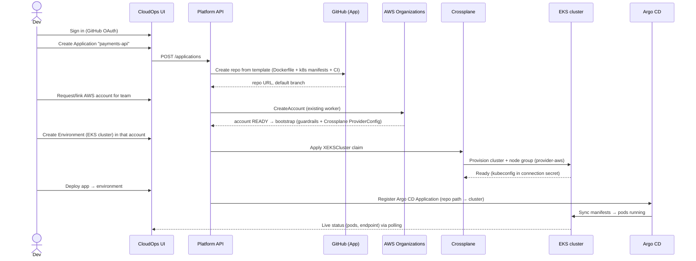
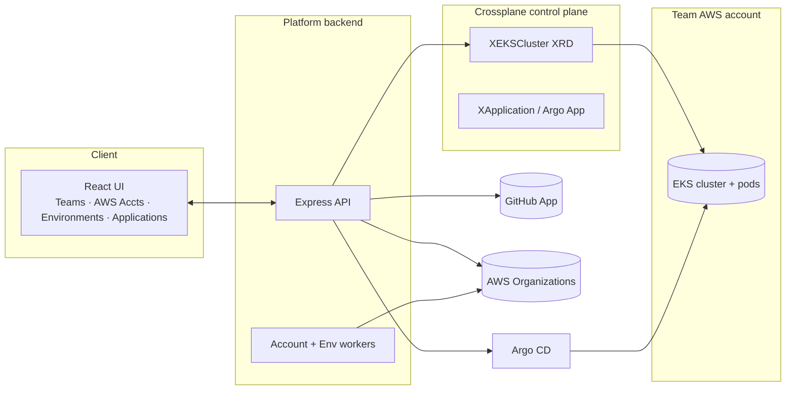

# Design Doc: Self-Service GitHub → AWS → EKS Delivery Platform

- **Status:** Draft / proposal
- **Date:** 2026-06-10
- **Author:** Petr
- **Related code:** `src/pages/{Teams,Environments,AwsAccounts}`, `backend/src`, `infra/compositions`

---

## 1. TL;DR

Today the app is a "CloudOps Platform" demo whose only fully-built capability is
**AWS account vending** plus a Crossplane environment provisioner that, in its
"Phase 2" state, deploys placeholder workloads (Postgres/Redis/an `nginx` dummy)
into the platform's *own* local cluster.

This doc proposes evolving it into a real **Internal Developer Platform (IDP)**
that delivers one golden path:

> A developer signs in with GitHub, **creates an application (a GitHub repo from a
> template)**, gets/links an **AWS account** for their team, provisions an
> **EKS cluster (an "environment")** in that account, and **deploys the repo into
> the cluster as Kubernetes pods** — all self-service from the UI.

It also realigns the three tabs to match that mental model:

| Tab | Today | Target |
| --- | --- | --- |
| **Teams** | Generic person records (name/email/role) | **GitHub org teams** + membership + repo/app ownership |
| **Environments** | In-cluster Helm Postgres/Redis/`nginx` dummy | **EKS clusters** provisioned into a team's AWS account |
| **AWS Accounts** | Link existing / create via AWS Organizations | (Mostly unchanged) + post-create **bootstrap** so we can deploy into it |
| **Applications** *(new)* | — | A **GitHub repo** + its **deployments** to environments |

---

## 2. Current state (what we're changing)

Grounded in the code as of this writing:

- **Teams** — `TeamMember` is `{ name, email, role, department, status }`
  (`src/types/team.ts`). No GitHub team concept. GitHub OAuth scope is just
  `['user:email']` (`backend/src/routes/auth.routes.ts:97`) — login only.
- **AWS Accounts** — `AwsAccountRef.type` is `'linked' | 'managed'`
  (`src/types/aws.ts`). The worker calls AWS Organizations `CreateAccount` via a
  `RealOrganizationsClient` when creds exist, else `MockOrganizationsClient`
  (`backend/src/server.ts:215`, `backend/src/services/account-worker.ts:31`).
  Guardrail application after create is a `TODO` (`account-worker.ts:65`).
- **Environments** — create options are `size / enableDatabase / enableCache`
  (`src/services/environmentsService.ts:16`); the real backend provisions
  in-cluster Postgres + Redis (Helm) and a hardcoded `nginx:alpine` Deployment
  (`infra/compositions/02-composition-teamenvironment.yaml:189`). No EKS.
- **No GitHub repo creation, no repo→deploy pipeline, no EKS** exist anywhere.

**Reusable foundations:** GitHub OAuth login, the AWS account-vending worker +
Organizations client abstraction, the Crossplane control plane + `provider-helm`
/ `provider-kubernetes` wiring, the optimistic-UI + activity-feed patterns.

---

## 3. Goals & non-goals

**Goals**
1. One end-to-end self-service path: GitHub repo → AWS account → EKS → running pods.
2. Redefine Teams/Environments/AWS Accounts to match the target model above.
3. Keep **demo mode** working with mocks (so the repo stays clone-and-run), with a
   real-backend path behind `VITE_USE_REAL_BACKEND`.
4. Preserve the optimistic-UI showcase (long-running provisioning is a great fit
   for optimistic + status-polling UX).

**Non-goals (for v1)**
- Multi-cloud (AWS/EKS only).
- Cost management / FinOps beyond the existing estimate fields.
- Arbitrary user-supplied Crossplane compositions.
- Production-grade multi-tenancy hardening (tracked separately).

---

## 4. Golden-path user journey



---

## 5. Target tab responsibilities

### 5.1 Teams → GitHub teams
- A platform **Team** maps to a **GitHub org team** (`slug`, `githubTeamId`).
- Membership is **sourced from GitHub** (sync) rather than hand-entered; role maps
  to GitHub team role (`member` / `maintainer`).
- A team **owns** AWS accounts, environments, and applications (ownership scoping).
- **Change vs today:** extend/replace `TeamMember` CRUD with GitHub-backed sync;
  needs elevated GitHub permissions (see §8). Keep a read-only "members" view; the
  optimistic-UI demo can move to a lighter action (e.g. inviting a member).

### 5.2 AWS Accounts → vend / link (mostly as-is)
- Keep `linked` (import existing) and `managed` (create via Organizations).
- **Add a post-`READY` bootstrap step** (currently the `TODO`): apply guardrails
  *and* install the cross-account role + Crossplane `ProviderConfig` so the
  platform can provision EKS into the account. An account isn't "deploy-ready"
  until bootstrap completes — add a status for it.

### 5.3 Environments → EKS clusters
- An **Environment** becomes an **EKS cluster** (or a logical target: a cluster +
  namespace) provisioned **into a team's AWS account**.
- Create form changes from `database/cache/size` to: target **AWS account**,
  **region**, **Kubernetes version**, **node instance type/size**, **min/max nodes**.
- Status lifecycle (`REQUESTED→CREATING→READY→…`) already exists in
  `TeamEnvironmentStatus` and maps cleanly to cluster provisioning.
- Replace `02-composition-teamenvironment.yaml` (Helm dummy) with an **EKS
  composition** (see §9).

### 5.4 Applications *(new concept)* → repo + deployments
- An **Application** = a GitHub repo (scaffolded from a template) owned by a team.
- A **Deployment** binds an application → an environment (cluster) and produces
  running pods, driven by GitOps (Argo CD) or a build pipeline.
- Surfacing options (open question, §12): a new **Applications** tab, or fold repos
  under **Teams** and deployments under **Environments** / **Activity**.

---

## 6. Architecture



**Key integration choices**
- **GitHub:** a **GitHub App** (org-installed) for platform actions — create repos,
  manage teams — using short-lived installation tokens and fine-grained
  permissions. Keep user **OAuth** purely for login/identity. (Alternative:
  broaden OAuth scopes to `repo`, `admin:org` — simpler but coarser and acts as
  the user; not recommended.)
- **AWS account vending:** reuse the existing Organizations worker; add bootstrap.
- **EKS provisioning:** Crossplane `provider-aws` (Upbound) `Cluster` + `NodeGroup`,
  wrapped in an `XEKSCluster` XRD so the UI submits a small claim. Cross-account
  provisioning via an assumed role created during account bootstrap.
- **Deployment:** **GitOps with Argo CD** (recommended) — the scaffold ships k8s
  manifests/Helm; CI builds the image on push and bumps the tag; Argo syncs into
  the target cluster. (Alternative: backend `kubectl apply` / push-based deploy —
  simpler to demo, weaker as a model. Decision in §12.)
- **In-cluster workloads** still use `provider-kubernetes`/`provider-helm` as today.

---

## 7. Data model changes (frontend `src/types`)

Sketches, not final:

```ts
// Teams: GitHub-backed
interface Team {
  id: string;
  githubTeamId: number;
  slug: string;            // GitHub team slug
  name: string;
  description?: string;
  memberCount: number;
}
interface TeamMember {     // sourced from GitHub
  login: string;           // GitHub handle
  name?: string;
  avatarUrl?: string;
  role: 'member' | 'maintainer';
}

// Environments: now an EKS cluster
interface TeamEnvironment {
  // ...existing id/name/teamId/status/health...
  awsAccountId: string;
  region: string;
  kubernetesVersion: string;
  nodeInstanceType: string;
  minNodes: number;
  maxNodes: number;
  clusterEndpoint?: string;
  oidcProviderArn?: string;     // for IRSA / Pod Identity
}

// New: Applications + Deployments
interface Application {
  id: string;
  teamId: string;
  name: string;
  repoUrl: string;
  defaultBranch: string;
  templateId: string;           // scaffold used
  latestImage?: string;
}
interface Deployment {
  id: string;
  applicationId: string;
  environmentId: string;        // target cluster
  status: 'PENDING' | 'SYNCING' | 'HEALTHY' | 'DEGRADED' | 'FAILED';
  revision?: string;            // git SHA / image tag
  url?: string;                 // ingress endpoint
  pods?: { name: string; phase: string }[];
}
```

Also extend `ActivityType` (`src/types/aws.ts:120`) with
`app.created`, `app.repo.scaffolded`, `cluster.created`, `deployment.created`,
`deployment.synced`, `deployment.failed`.

---

## 8. API & permissions

**New/changed endpoints (Express backend):**
- `GET /api/teams`, `GET /api/teams/:slug/members` — proxy GitHub teams.
- `POST /api/applications` — scaffold repo from template; `GET /api/applications`.
- `POST /api/environments` — body changes to EKS params (account/region/version/nodes).
- `POST /api/deployments` — bind app→environment; `GET /api/deployments/:id` (status/pods).

**GitHub App permissions:** Repository `Administration: write` (create repos),
`Contents: write` (push scaffold), Organization `Members: read`,
`Team: read/write` (manage teams). Store installation id per org.

**AWS:** management-account role to call Organizations (exists); per-member-account
role (`OrganizationAccountAccessRole` or a dedicated provisioning role) assumed by
Crossplane to create EKS. EKS workloads use **IRSA / EKS Pod Identity** for app AWS
access (no static keys).

---

## 9. Infra / Crossplane changes

- **New** `XEKSCluster` XRD + composition (`infra/compositions/`) using
  `provider-aws` `Cluster`, `NodeGroup`, IAM roles, and an OIDC provider; emit
  kubeconfig to a connection secret.
- **New** account-bootstrap composition (extends
  `04-composition-guardrailed-account.yaml`): guardrails + cross-account role +
  `ProviderConfig` so the control plane can target the new account.
- **Replace** `02-composition-teamenvironment.yaml`'s dummy app with the GitOps
  hand-off (register an Argo CD `Application`), or keep an optional "sample
  workload" toggle for demos.
- **Demo mode:** MSW handlers (`src/mocks/handlers.ts`) gain `/api/applications`
  and `/api/deployments`, and the environment template `resources` change from
  `VPC/ECS/RDS` to EKS-shaped data — all still mocked so the repo stays
  clone-and-run.

---

## 10. Phased rollout

| Milestone | Scope | Demo-able outcome |
| --- | --- | --- |
| **M0 (now)** | Account vending + in-cluster env provisioner | Existing demo |
| **M1** | Data model + UI for Applications/Deployments; **all mocked** in demo mode | Full golden-path UX clickable end-to-end with mocks |
| **M2** | Teams → real GitHub teams (read/sync) via GitHub App | Live team membership |
| **M3** | Applications → real repo scaffolding from template | Clicking "Create app" makes a real repo |
| **M4** | Environments → real EKS via Crossplane `XEKSCluster` + account bootstrap | Real cluster appears, status polled |
| **M5** | Deployments → Argo CD GitOps; CI builds image | `git push` → pods live in EKS |

M1 alone delivers most of the *product* story (and keeps the optimistic-UI demo
front and center) without standing up real AWS/EKS.

---

## 11. Security considerations

- **GitHub App** with least-privilege, short-lived installation tokens; never act
  with the end-user's broad OAuth token for org-level writes.
- **Cross-account IAM:** dedicated provisioning role per member account, scoped to
  EKS/IAM/EC2 needed for clusters; assume-role with external id; no long-lived keys.
- **Workload identity:** IRSA / EKS Pod Identity for app→AWS access.
- **Guardrails before deploy-ready:** CloudTrail/Config/Budgets/SCPs applied during
  bootstrap (closes the current `account-worker.ts:65` TODO).
- **Tenant isolation:** team→account→cluster ownership enforced server-side on every
  mutating endpoint.

---

## 12. Open questions / decisions needed

1. **Deployment mechanism:** GitOps (Argo CD) — recommended — vs. backend
   push-based `kubectl apply`. Affects M5 and infra surface.
2. **Cluster granularity:** one EKS cluster per environment (clean, costly) vs. a
   shared cluster with a namespace per environment (cheap, weaker isolation).
3. **Where do Applications live in the IA:** a new **Applications** tab, or repos
   under Teams + deployments under Environments?
4. **GitHub App vs. expanded OAuth scopes** (recommend App).
5. **Team source of truth:** GitHub teams as canonical (sync-only) vs. platform
   teams that *create* GitHub teams.
6. **Scope of "create repo":** empty repo vs. opinionated template (Dockerfile +
   Helm chart + CI workflow). Recommend template — it's what makes deploy automatic.

---

## 13. Out of scope (future)
- Multi-cloud / non-EKS targets, preview environments per PR, progressive delivery
  (canary/blue-green), cost dashboards, and policy-as-code beyond account guardrails.
